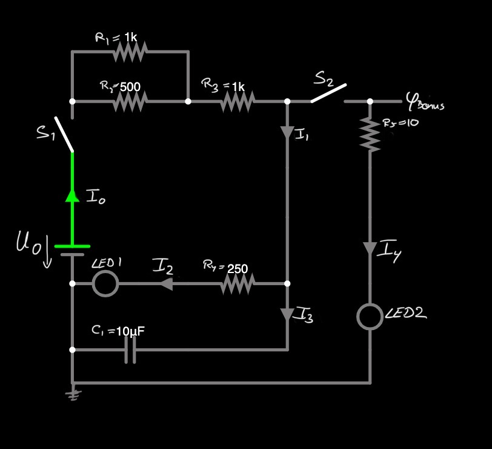

# Aufgabe 01 - Smooth LED

Autor: Christopher Klix

[Open image in browser](./circuit-20230112-1258.jpg)

gegeben:

**U_0** = 9V

**R_1** = 1k Ohm \
**R_2** = 500 Ohm \
**R_3** = 1k Ohm \
**R_4** = 250 Ohm \
**R_5** = 10 Ohm

**C_1** = 10µF

## Lösung

Click [here](./ET1_Klausuraufgabe_01_Loesung.md) to see the solution.

## Richtig/Falsch Fragen

Beide Schalter $S_1$ und $S_2$ sind zunächst _geöffnet_.

Schalter $S_1$ wird _geschlossen_ und bleibt geschlossen...

1. Die LED ist "sofort" an, sobald $S_1$ _geschlossen_ wird.
1. Der Strom $I_3$ bleibt _konstant_.
1. Durch $R_1$ fließt Strom.

Nach **10 Sekunden** zeigt das _Ampere-Meter_ $I_0 = 4.605mA$ an.

4. Der Widerstand der **LED 1** beträgt $371.33 \Omega$.
1. Die **LED 1** hat einen Spannungsabfall von $2.4V$.
1. Das _Ampere-Meter_ $I_1$ zeigt einen Strom von 4.605mA

Nun wird auch der Schalter $S_2$ geschlossen...

7. Die **LED 1** wird _dunkler_.
1. Der Kondensator _entlädt_ sich.
1. Es gibt einen **Kurzschluss**.

## Verständnis-Fragen

Nun wird der Schalter $S_1$ wieder **geöffnet** und die beiden LEDs gehen langsam aus (sie dimmen in wenigen Sekunden).

10. Warum ist dies der Fall?

11. Wieso verhält sich die LED wie ein Widerstand und sorgt für einen Spannungsabfall?

12. Wieso wird die **LED 1** dunkler, wenn der Schalter $S_2$ (s. Aufgabe 7.) geschlossen wird?

## Bonus Frage

Welche Spannung herrscht an $\phi_{Bonus}$, wenn beide Schalter S_1 und S_2 geschlossen sind und einige Sekunden gewartet wird?
