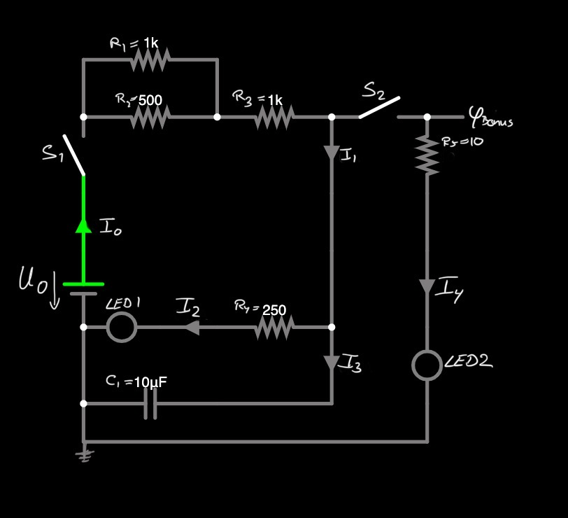
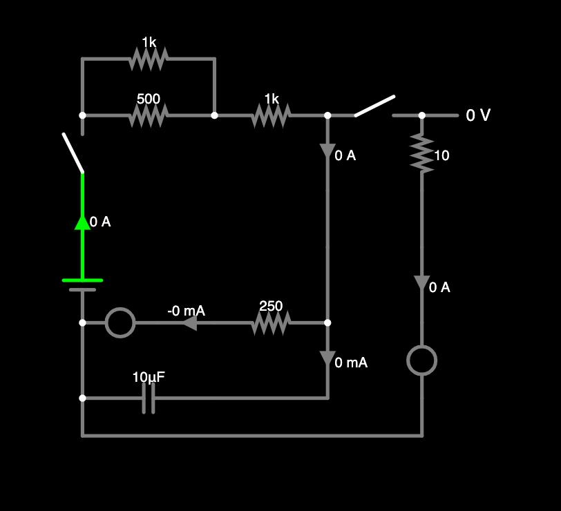
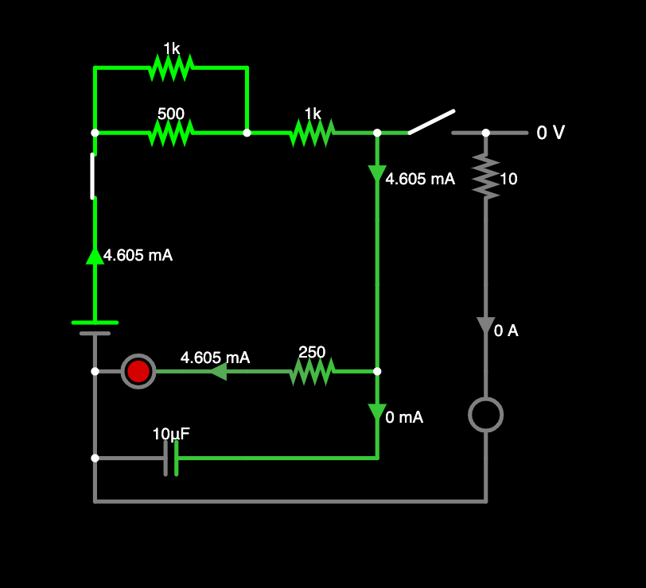
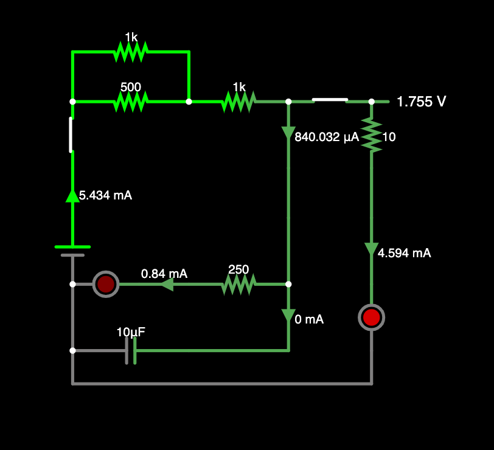

# Aufgabe 01: Lösung

Autor: Christopher Klix

[Open image in browser](circuit-20230112-1246.png)

gegeben:

**U_0** = 9V

**R_1** = 1k Ohm \
**R_2** = 500 Ohm \
**R_3** = 1k Ohm \
**R_4** = 250 Ohm \
**R_5** = 10 Ohm

**C_1** = 10µF

## Richtig/Falsch Fragen

Beide Schalter $S_1$ und $S_2$ sind zunächst _geöffnet_.

Schalter $S_1$ wird _geschlossen_ und bleibt geschlossen...

1. Die LED ist "sofort" an, sobald $S_1$ _geschlossen_ wird. \
    **Antwort:** Falsch
1. Der Strom $I_3$ bleibt _konstant_. \
    **Antwort:** Falsch
1. Durch $R_1$ fließt Strom. \
    **Antwort:** Richtig

Nach **10 Sekunden** zeigt das _Ampere-Meter_ $I_0 = 4.605mA$ an.

4. Der Widerstand der **LED 1** beträgt $371.33 \Omega$. \
    **Antwort:** Richtig
1. Die **LED 1** hat einen Spannungsabfall von $2.4V$. \
    **Antwort:** Falsch
1. Das _Ampere-Meter_ $I_1$ zeigt einen Strom von 4.605mA \
    **Antwort:** Richtig

Nun wird auch der Schalter $S_2$ geschlossen...

7. Die **LED 1** wird _dunkler_. \
    **Antwort:** Richtig
1. Der Kondensator _entlädt_ sich. \
    **Antwort:** Falsch
1. Es gibt einen **Kurzschluss**. \
    **Antwort:** Falsch

## Verständnis-Fragen

Nun wird der Schalter $S_1$ wieder **geöffnet** und die beiden LEDs gehen langsam aus (sie dimmen in wenigen Sekunden).

10. Warum ist dies der Fall?

    **Antwort:** Weil der Kondensator geladen ist und langsam seine gespeicherte Energie an der Stromkreis abgibt.

11. Wieso verhält sich die LED wie ein Widerstand und sorgt für einen Spannungsabfall?

    **Antwort:** Weil eine LED Energie in Form von Wärme und Licht abgibt, welche von der Batterie bezogen wird.

12. Wieso wird die **LED 1** dunkler, wenn der Schalter $S_2$ (s. Aufgabe 7.) geschlossen wird?

    **Antwort:** Da der Kondensator geladen ist und damit keine Stromfluss zulässt, teilt sich der Strom auf die beiden LEDs auf. Da der Widerstand vor der 2ten LED deutlich geringer ist als der Vorwiderstand von LED 1, fließt mehr Strom durch LED 2 und diese wird heller.

## Bonus Frage

Welche Spannung herrscht an V_Bonus, wenn beide Schalter S_1 und S_2 geschlossen sind und einige Sekunden gewartet wird?

**Antwort:** $1.755V$

## Lösungssimulationen

Falstad Simulation [https://falstad.com/...](https://falstad.com/circuit/circuitjs.html?ctz=CQAgjCAMB0l3BWcMBMcUHYMGZIA4UA2ATmIxAUgoqoQFMBaMMAKACcQ09wVvs0e3WnHad8IPFX5VJUZCIDuIaRKkCwvKKJUbuAFjCFBcsPFEGjuPcoFW5KSiwDGNqYW5dl7uTHhxSAYFBpODQGAiU2ISEGHjYBHiSRpAsSp5RHuJ2KQDOIBbGesRGuj4gAGYAhgA2OXQshij5xcqQ1kWW3k0AJnRVAK7VAC4M1XTd4GW+rEodXvotenBas4vLnktUKWnim2J83tv5hvOupynYGGpSbZwYTXYQVCgNhE2YD7fpXyC9A8OjcaTLZQWCsS5UAp2KHeJ6cFgAN32rWsnhQSzKGOIU2gCBYAHlmiVNAg9NZSk9UsjSp5ZBcrsdifoTmBiE04UcCujISdsuYWqU5qymlRTCwIUTOBi5o8fCw8p5hdTNCCqrV6hK0RjFWzgStGeBdVyMZyBUaWtytEA)

