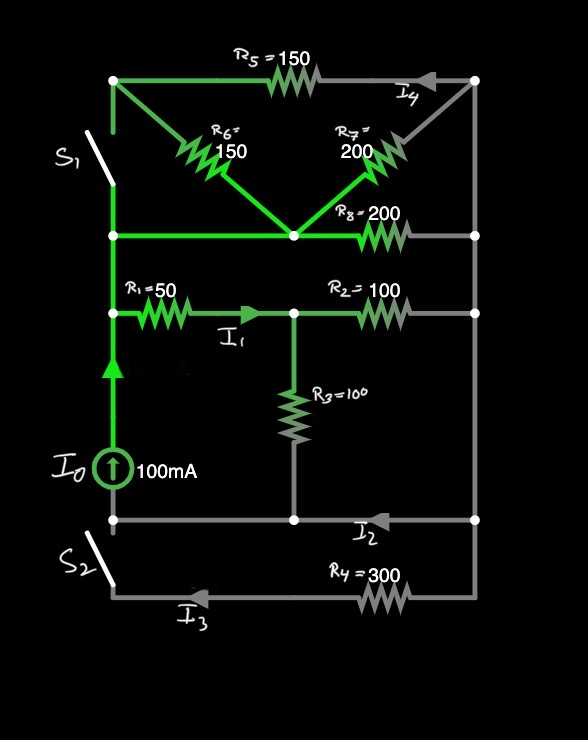

# Aufgabe 02

Autor: Kataryna Bodrova

[Open image in browser](./circuit-20230112-1355.jpg)

gegeben:

**$I_0$** = $100mA$

**$R_1$** = $50 \Omega$ \
**$R_2$** = $100 \Omega$ \
**$R_3$** = $100 \Omega$ \
**$R_4$** = $300 \Omega$ \
**$R_5$** = $150 \Omega$ \
**$R_6$** = $150 \Omega$ \
**$R_7$** = $200 \Omega$ \
**$R_8$** = $200 \Omega$

## Richtig/Falsch Fragen

Beide Schalter $S_1$ und $S_2$ sind zunächst _geöffnet_.

1. Der Strom $I_1$ ist größer als der Strom $I_2$.
1. $R_2$ erzeugt einen Spannungsabfall von $2.143V$

Schalter $S_2$ wird geschlossen.

3. Der Strom $I_3$ ist größer als der Strom $I_2$.
1. Der Strom $I_7$ ist negativ.
1. Der Strom $I_2$ ist positiv.

Schalter $S_1$ wird geschlossen.

6. Durch $R_6$ fließt kein Strom mehr.
1. Durch $R_7$ fließt kein Strom mehr.
1. Die Schaltung besitzt eine ideale Stromquelle.

## Verständnis-Fragen

9. Wie viel abhängige Maschen enthält die Schaltung?
